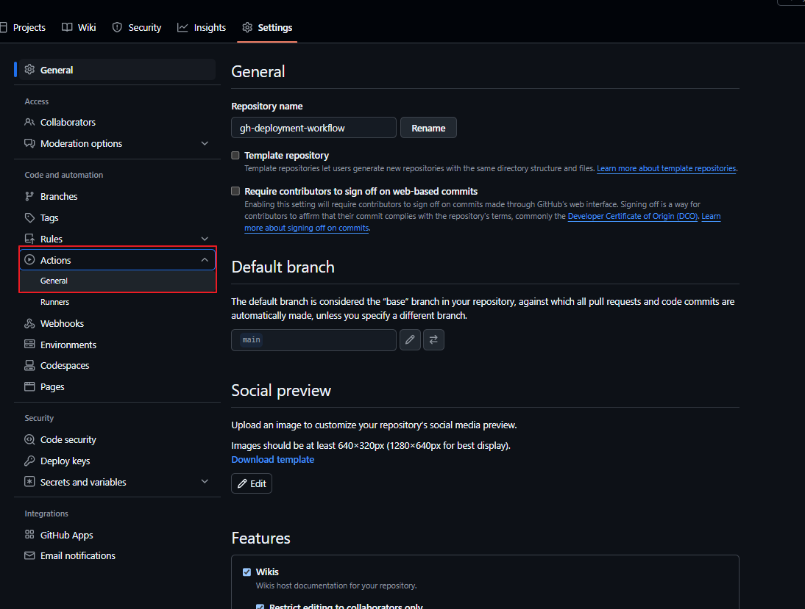
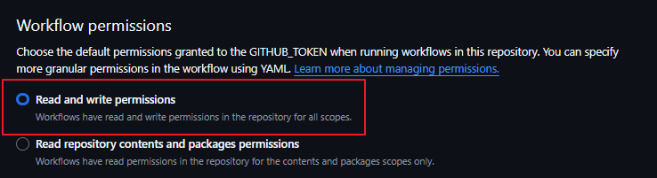

# Github Action을 사용하여 배포해보기

1. **"Hello Actions" 내용이 들어간 index.html 파일 생성**

2. **.github/workflows 폴더에 deploy.yml 파일 생성**

3. **deploy.yml 파일에 Github Pages 용 Branch 추가 하도록 내용 추가**

4. **Settings -> Actions -> General -> Workflow permissions 항목에서 Read and write permissions 설정**

5. **Settings -> Pages -> Build and deployment -> Branch 설정**

