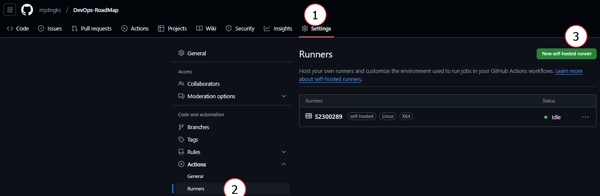
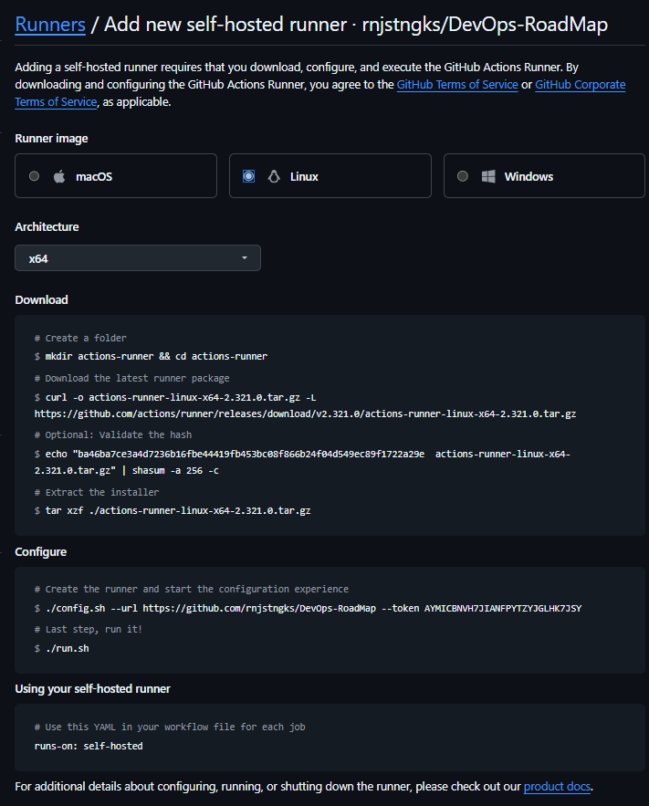

# Terraform을 사용하여 가상머신 생성 후 Ansible을 사용하여 index.html 페이지 변경

앞서 configuration-management와 iac-on-vmware에서 공부했던 내용을 바탕으로 구성 및 설정해보도록 하겠습니다.

먼저

Github Action을 가상환경에서 동작하는 것이 아닌, 자신의 노트북 환경에서 돌리기 위해 Github Action 설정을 변경해주도록 하겠습니다.

Settings -> Actions -> Runners -> New self-hosted runner

그리고 자기 환경에 맞게 설치를 해주면 됩니다.

설치를 완료하고, Configure에 나와있는 run.sh 스크립트를 실행해주면 자신의 노트북 환경에서 Github Action을 동작 시킬 수 있습니다.
